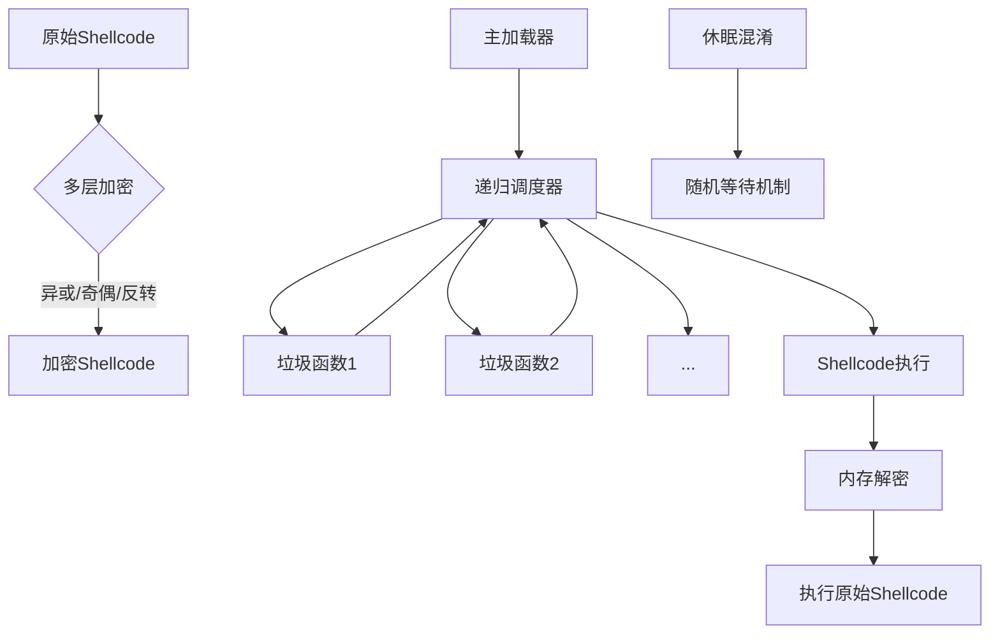

# RecurLoader

RecurLoader 一个Shellcode混淆加载器，通过多层递归调用、垃圾代码注入和多层加密技术，规避反病毒软件的检测。通过调整参数快速生成shellcode loader,被查杀后尝试更改参数即可。

## 核心特性

- **递归调度机制**：通过深度控制的递归调用扰乱执行流分析
- **多层加密保护**：支持20000+层的异或加密、奇偶位加密和字节反转
- **动态API解析**：规避静态导入表分析
- **智能休眠混淆**：随机化休眠行为以绕过时间敏感检测
- **垃圾代码注入**：生成大量无意义函数和代码片段
- **编译时混淆**：每次生成独特的二进制结构

## 技术架构

## 使用指南

### 前置要求

1. Python 3.7+
2. MinGW-w64 编译器
3. 64位Windows操作系统

或直接使用releases版

### 安装依赖

```
pip install tqdm
```

### 配置说明

1. 将您的stageless shellcode保存为`payload_x64.bin`并放置在项目根目录
2. 确保MinGW-w64位于`项目目录/mingw64/bin`或已加入系统PATH

### 运行加载器

```
python obfuscate.py
```

### 自定义参数

在`obfuscate.py`中调整以下参数：

```
code = generate_obfuscated_code(
    num_junk_funcs=30000,   # 垃圾函数数量 (4-30000)
    redundancy=10,          # 冗余操作上限 (3-10)
    sleep_range=1,          # 休眠时间范围(秒) (2-5)
    xor_layers=20000,       # 加密层数 (1-20000)
    max_deep=30,            # 最大递归深度 (1-30)
    shellcode_file_path="payload_x64.bin",
    num_fragments=10        # 垃圾代码片段数量
)
```

## 工作原理

1. **预处理阶段**：
   - 对原始shellcode应用多层加密（异或+奇偶位+反转）
   - 生成加密后的shellcode数组
2. **混淆编译**：
   - 创建包含大量垃圾函数的递归调度器
   - 注入随机休眠和冗余操作代码
   - 编译为独立可执行文件
3. **运行时执行**：
   - 递归调用垃圾函数消耗分析资源
   - 在内存中解密并执行shellcode
   - 使用随机休眠策略绕过行为检测

## 高级功能

- **动态休眠混淆**：替换标准Sleep API，使用随机等待策略
- **内存混淆**：执行前对内存中的shellcode进行动态混淆
- **环境自检**：自动配置MinGW编译环境
- **编译优化**：使用`-O2`优化级别减小文件体积


# 效果演示


## 免责声明

本项目仅用于教育目的和安全研究。使用者应对其行为负全部责任。作者不对任何滥用行为负责。
